- [环境配置文档](#环境配置文档)
  - [CUDA](#cuda)
    - [安装包下载](#安装包下载)
    - [CUDA安装](#cuda安装)
  - [cuDNN](#cudnn)
    - [压缩包下载](#压缩包下载)
    - [cuDNN安装](#cudnn安装)
  - [Conda](#conda)
    - [安装包下载](#安装包下载)
    - [安装与配置](#安装与配置)
      - [安装](#安装)
      - [配置](#配置)
  - [Visual Studio Code](#visual-studio-code)
    - [下载安装包](#下载安装包)
    - [配置环境](#配置环境)
  - [PyTorch](#pytorch)
  - [PowerShell配置](#powershell配置)
  - [Python](#python)
    - [使用conda创建一个虚拟环境](#使用conda创建一个虚拟环境)


# 环境配置文档
## CUDA
### 安装包下载
1. 前往[CUDA Toolkit Archive](https://developer.nvidia.com/cuda-toolkit-archive)
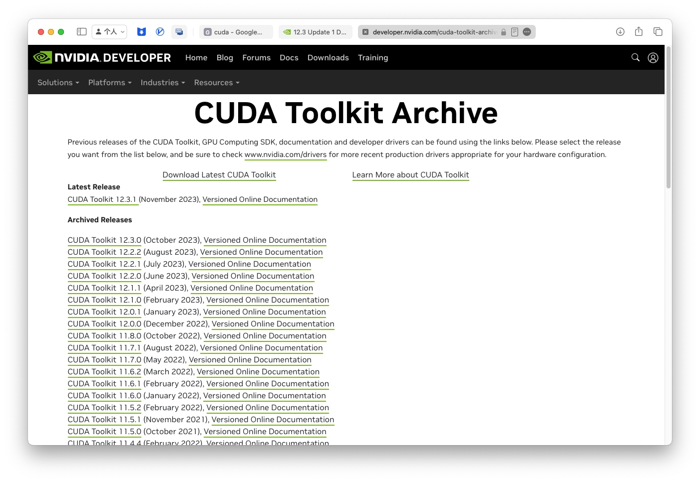
2. 下载在之前提到的Cuda 12.1版本，这里选择[CUDA Toolkit 12.1.1](https://developer.nvidia.com/cuda-12-1-1-download-archive)进行下载，点击链接进入，选择`Windows`、`x86_64`、`10`、`exe(local)`，点击网页中的`exe(local)`开始下载。
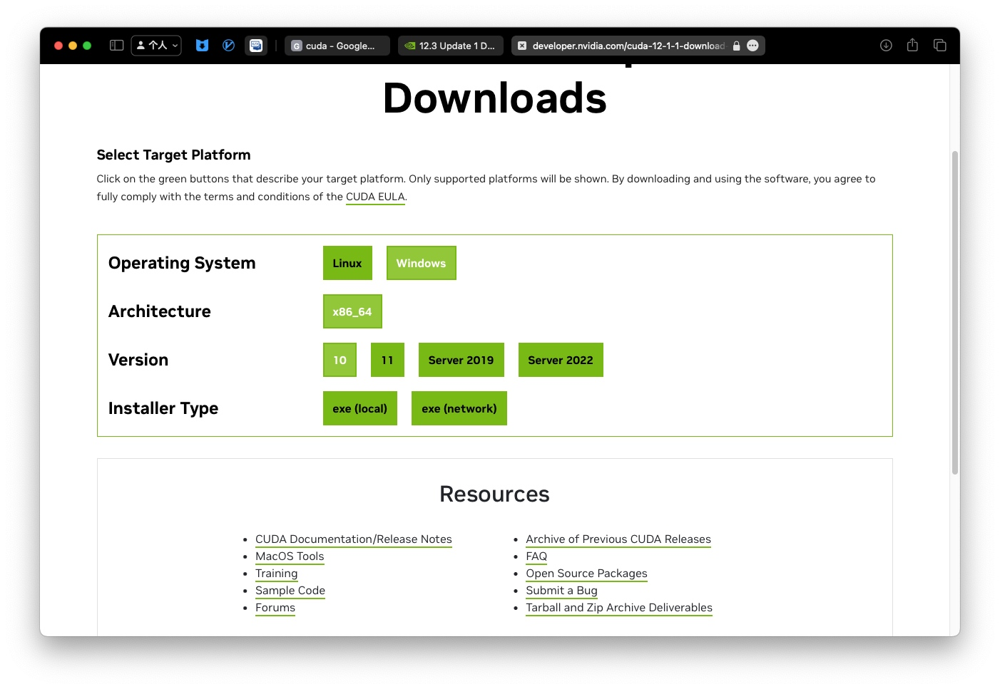
### CUDA安装
1. 下载完成后得到一个大概3g的安装包，打开进行安装，选择一个临时目录进行解压，点击ok
 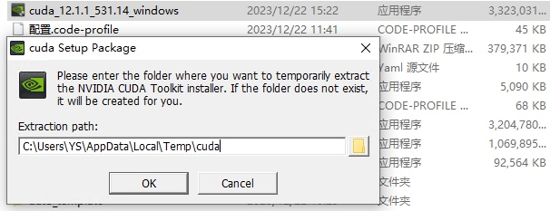
 2. 等待解压完成
 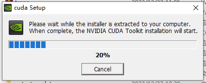
3. 解压完成后进入安装界面，这里也需要等待
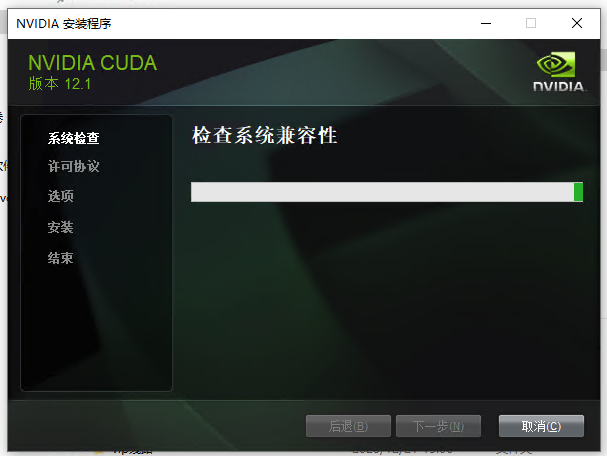
4. 点击同意并继续
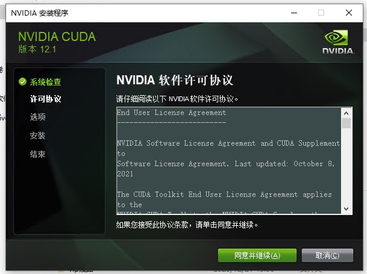

5. 点击自定义后点击下一步
 
6. 展开CUDA选项取消勾选`Visual Studio Integration`，如图所示，其余不动，点击下一步
 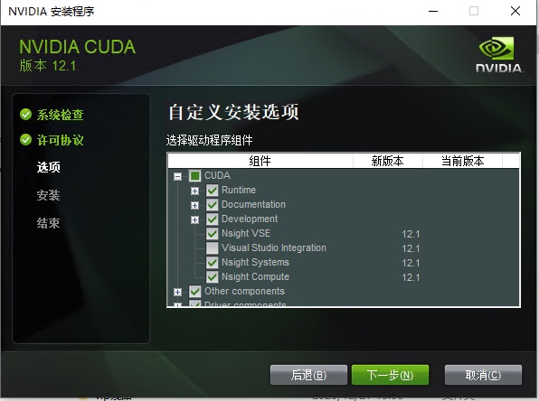
7. 安装位置不需要修改，直接点击下一步
 
8. 等待安装结束即可


## cuDNN
### 压缩包下载
1. **cuDNN**和**CUDA**是配套的，需要下载相对应的版本，进入[cuDNN官网](https://developer.nvidia.com/cudnn)
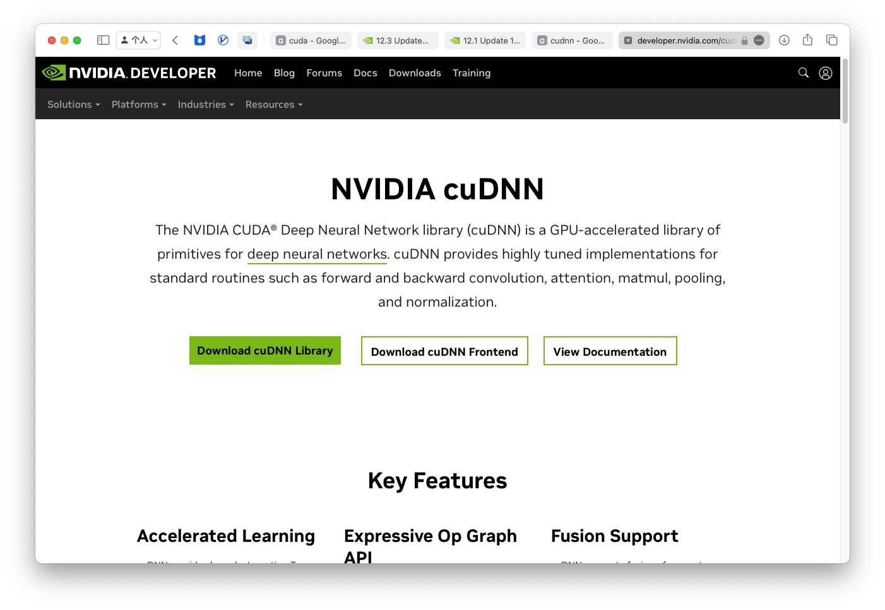
2. 需要**注册账号**后才能进行下载

3. 注册好账号之后点击`Download cuDNN Library`按钮进入下图的下载界面
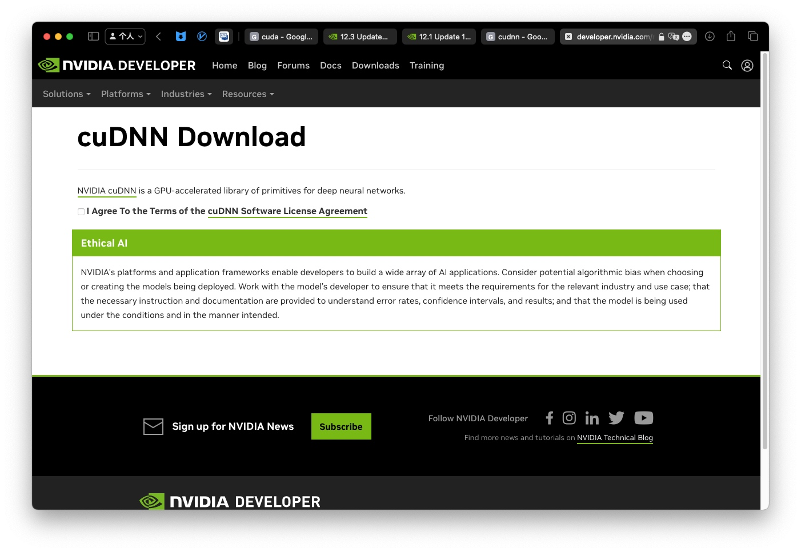
4. **同意协议**后，选择`for CUDA 12.x`进行下一个界面

5. 这里选择第一个`Local install for Windows(Zip)`进行下载

### cuDNN安装
1. 下载完成后得到一个压缩包
 
2. 解压该压缩包可以看到其中有三个文件夹
 
3. 选择三个文件夹`bin`、`include`、`lib`并复制到CUDA的安装目录，默认目录为
```
C:\Program Files\NVIDIA GPU Computing Toolkit\CUDA\v12.1
```
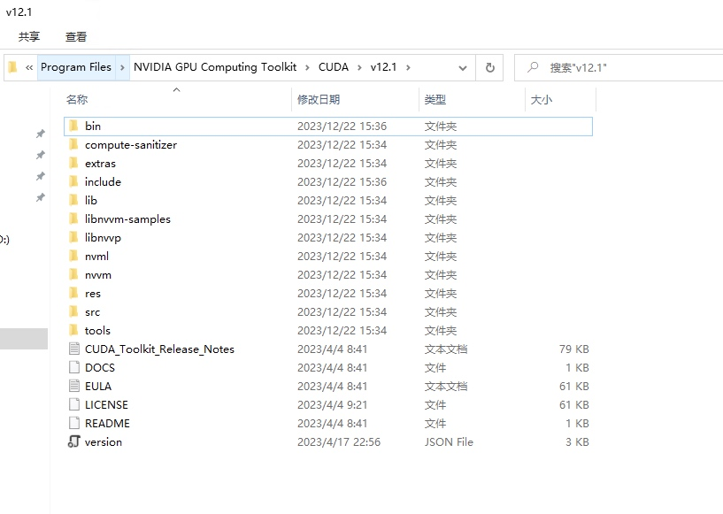
复制过程中出现弹窗，选择**替换**即可
4. 将CUDA添加到**环境变量**中
- 按WIN+R，打开【运行】对话框。 输入sysdm.cpl，点【确定】按钮，点开高级选项卡，点开环境变量
 
- 选择**系统变量**中的Path，点击编辑，在这里需要添加CUDA的相关路径，有四个，进入先前的CUDA安装路径，点击右上侧的`新建`按钮，添加以下路径
```
C:\Program Files\NVIDIA GPU Computing Toolkit\CUDA\v12.1\bin
```
```
C:\Program Files\NVIDIA GPU Computing Toolkit\CUDA\v12.1\include
```
```
C:\Program Files\NVIDIA GPU Computing Toolkit\CUDA\v12.1\lib
```
```
C:\Program Files\NVIDIA GPU Computing Toolkit\CUDA\v12.1\libnvvp
```
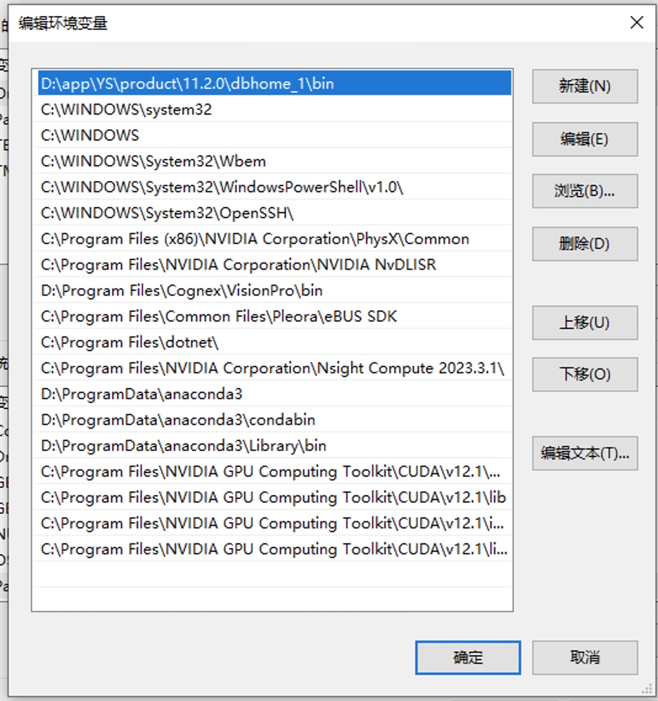


 
## Conda
> Conda本身是一个开源的包管理和环境管理系统，用于安装、运行和升级包和其依赖。Conda可以在不同的Python发行版中使用，其中Anaconda和Miniconda是最著名的两种发行版，它们都包括了conda这个工具。
>  **环境管理器：**
>    - **创建隔离环境：** Conda允许用户创建隔离的环境，每个环境都可以有不同的Python版本和/或包。这对于管理不同项目的依赖非常有用，避免了包之间的冲突。
>    - **环境复制：** 可以轻松地复制和共享环境，这对于确保代码在不同计算机或用户之间可重复是非常有用的。
> Conda是一个强大的工具，主要用于科学计算领域，它的作用可以从几个不同的方面来理解：
### 安装包下载
本文档选择**Anaconda**进行安装，进入[Anaconda下载](https://www.anaconda.com/download#downloads)，下载Windows版本的安装包即可

### 安装与配置
#### 安装
1. 打开下载好的安装包进行安装步骤
 
2. 点击`Next`进入下一步
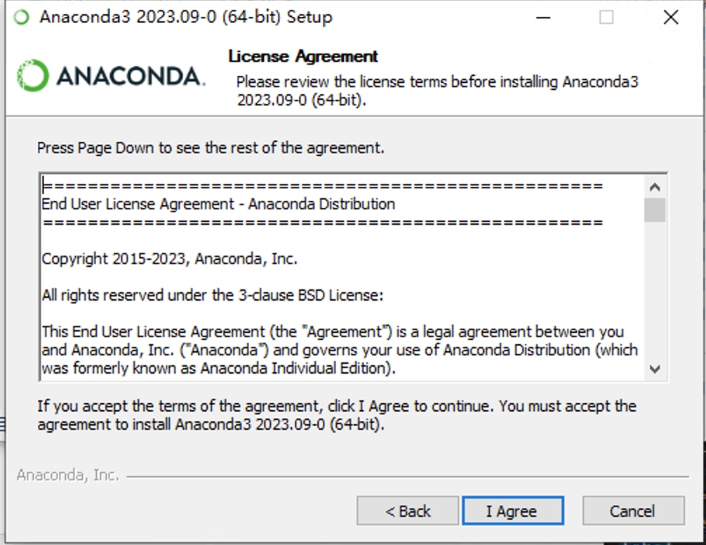
3. 点击`I Agree`同意协议
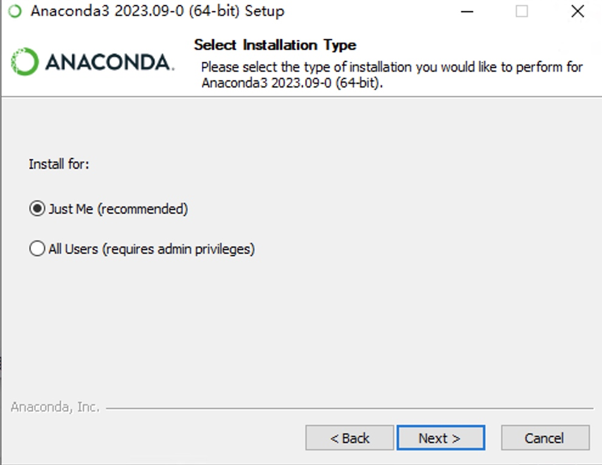
4. 保持默认选择`Just Me`，点击下一步
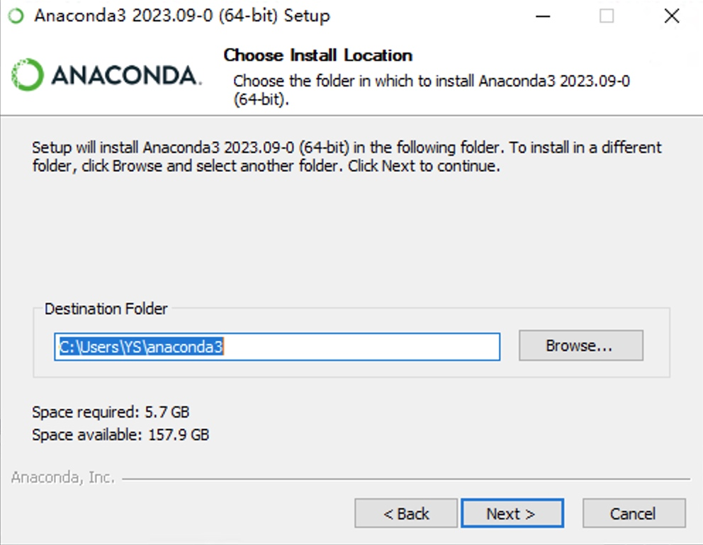
5. 这里可以选择其他安装位置，最好是默认的
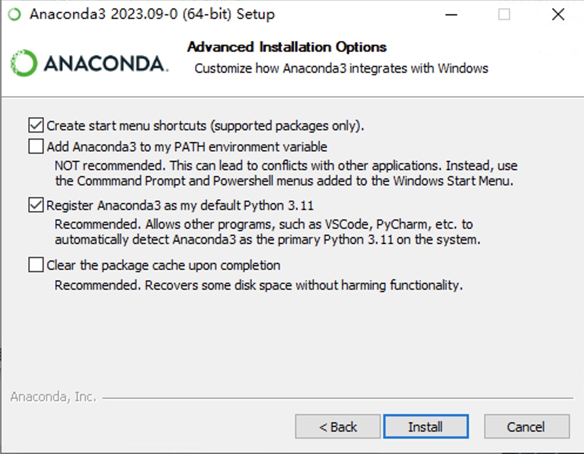
6. 仍然保持默认选择，点击`Install`进行安装，等待安装完成
#### 配置
> 主要是配置环境变量，步骤与配置CUDA的步骤一样
1. 按WIN+R，打开【运行】对话框。 输入sysdm.cpl，点【确定】按钮，点开高级选项卡，点开环境变量
 
2. 选择**系统变量**中的Path，点击编辑，在这里需要添加Conda的相关路径，有三个，进入先前的Conda安装路径，点击右上侧的`新建`按钮，添加以下路径
```
D:\ProgramData\anaconda3
```
```
D:\ProgramData\anaconda3\condabin
```
```
D:\ProgramData\anaconda3\Library\bin
```
**注意**：这里的`D:\ProgramData\anaconda3`是anaconda的安装路径，应该替换为你实际的安装地址，添加路径之后应该是这样的

## Visual Studio Code
### 下载安装包
进入[vscode官网](https://code.visualstudio.com)，下载**Windows**的**Stable**安装包
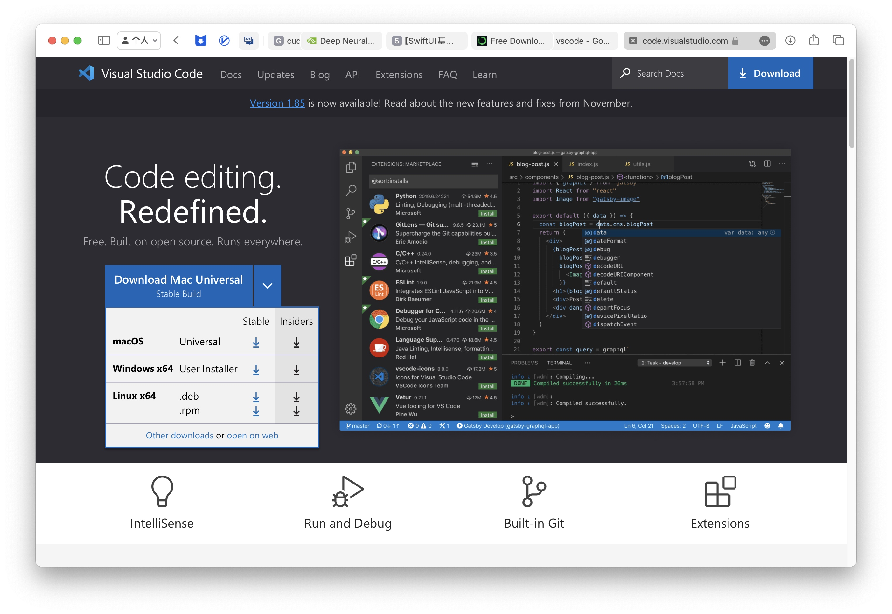
### 配置环境
> 在VScode中配置python的运行环境
1. 设置VScode语言为中文
- 点击左侧的扩展按钮，搜索`Chinese`插件并安装
 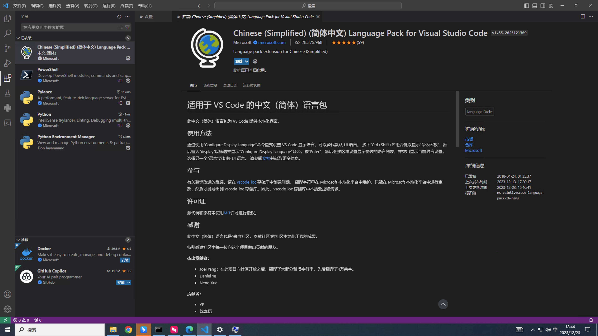
- 按下快捷键`Ctrl+Shift+P`，输入`config display language`，选择中文即可
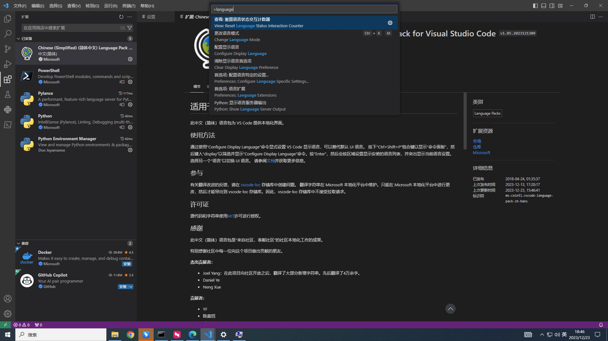
2. 安装Python扩展，在左侧扩展栏搜索`Python`、`Python Environment Manager`进行安装
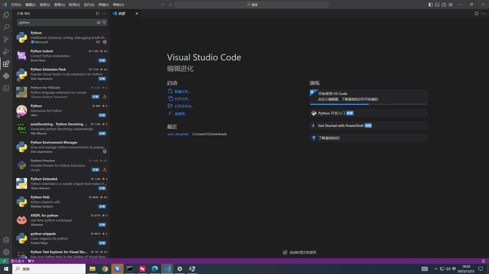
3. Conda设置
打开vscode设置，搜索conda，在下图中填入conda路径即可
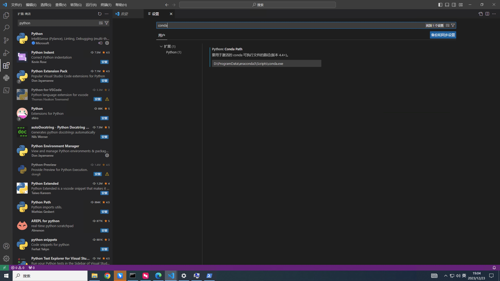

## PyTorch
[Pytorch](https://pytorch.org)是yolo进行检测与训练需要的最基本的库，也需要根据当前最新的pytorch支持的cuda版本，选择对应版本的CUDA安装，

在网站中`Pytorch Build`选择`Stable`，`Your OS`选择`Windows`，`Package`选择`Pip`，`Language`选择`Python`，`Compute Platform`选择较新的版本（是因为4060ti是较新的显卡），即`CUDA 12.1`，最终选择如图，复制最后的`Run this Command`
```
pip3 install torch torchvision torchaudio --index-url https://download.pytorch.org/whl/cu121
```
## PowerShell配置
> 前面的conda安装好之后，需要对`PowerShell`进行简单的配置
1. 在菜单栏中找到`PowerShell`，点击`以管理员身份运行`。
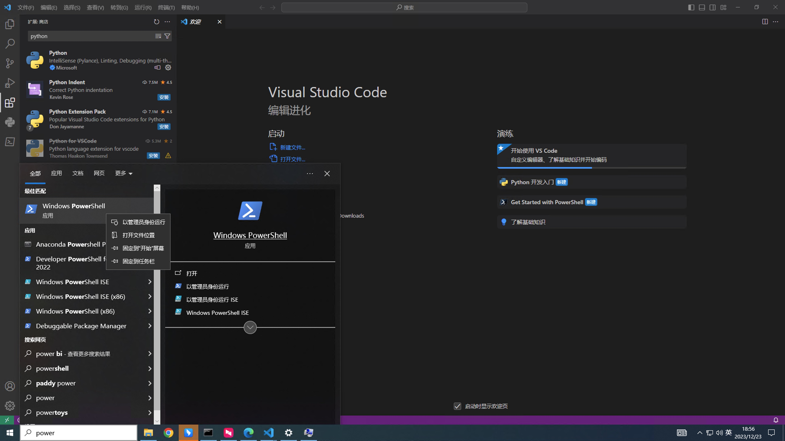
2. 打开后执行以下命令
```powershell
conda init
```
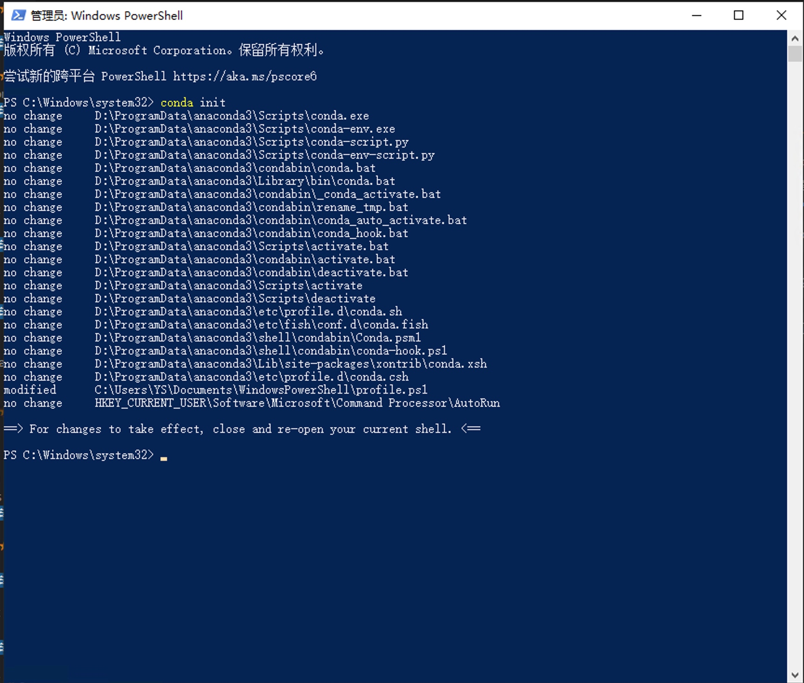

3. 更改PowerShell的脚本执行策略为`Unrestricted`，通过如下命令进行设置
```powershell
Set-ExecutionPolicy Unrestricted
```
运行`Get-ExecutionPolicy`以确认更改已生效

## Python
> 配置一个独立的python环境
### 使用conda创建一个虚拟环境
1. 打开vscode，新建一个终端
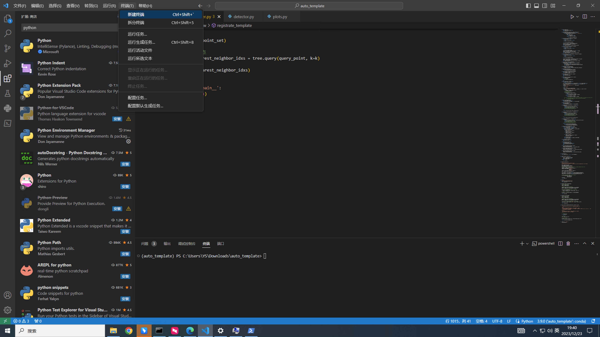
2. 在终端中输入以下命令创建一个环境
```powershell
conda create -n auto_template python==3.9
```
3. 激活环境
创建完成后输入`conda activate auto_template`激活环境，在输入之前的pytorch命令安装pytorch
```
pip3 install torch torchvision torchaudio --index-url https://download.pytorch.org/whl/cu121
```
安装完成后，创建一个测试用的python文件，输入以下代码
```python
import torch
print(torch.cuda.is_available())
```
运行后查看输出是否为`True`，为`True`则代表安装一切顺利
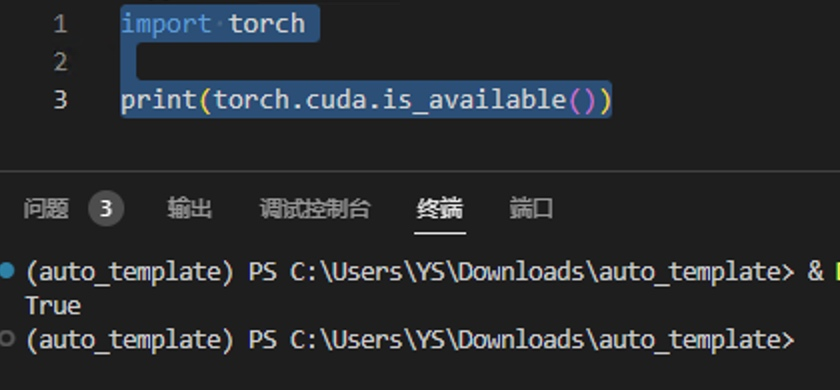


